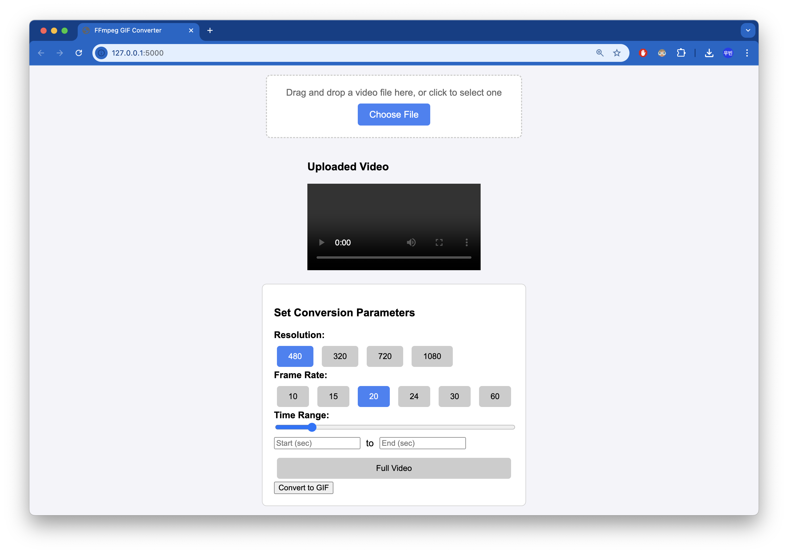

# FFmpeg GIF Converter

A simple web application to convert video files into GIFs using **FFmpeg**. Upload a video, customize settings (resolution, frame rate, or time range), and generate your GIF effortlessly.

## Features

- **Easy Upload:** Drag and drop or select a video file.
- **Customizable Settings:** Choose resolution, frame rate, and a specific time range for the GIF.
- **Responsive Design:** Works on both desktop and mobile.
- **Powered by FFmpeg:** Reliable video-to-GIF conversion.

## How to Use

1. **Upload a Video:** Drag and drop a video file or click the upload button.
2. **Set Parameters:** Select your desired resolution, frame rate, and time range.
3. **Convert to GIF:** Click the "Convert to GIF" button.
4. **Download:** Once the conversion is complete, download your GIF.

## Screenshot

